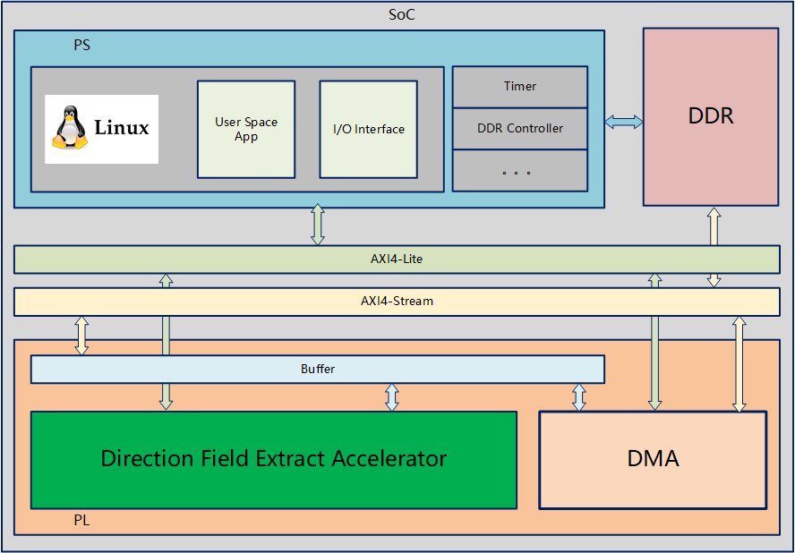
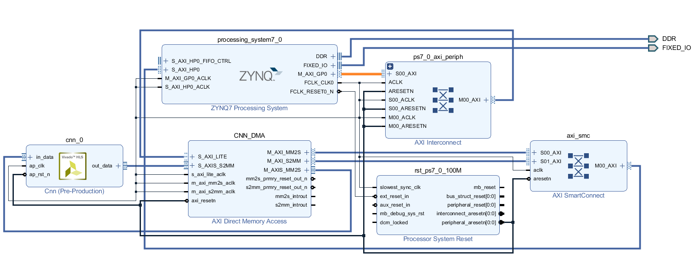
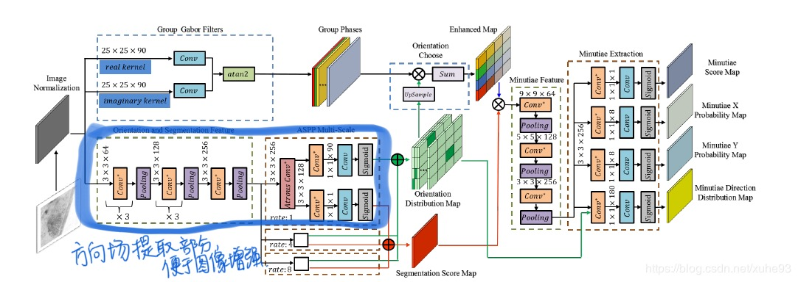

# 海量指纹库匹配任务加速机制设计
>                            组长：孙舒婷 小组成员：时辰、徐丹丹、宁坤、仇实
---
- **项目灵感来源**

    从各类现场或文件中所能提取到的指纹信息往往会伴随各种污点和损坏，影响指纹识别的效果和速度，为了解决该问题，许多研究都提出，可以先从原始图片中，通过卷积层的计算进行图片的特征提取获取指纹的方向场信息，再将该方向场信息做进一步的处理，比如协助图像增强和海量数据的预分类，加速在海量指纹库中与匹配到目标指纹的速度。此外，根据方向场信息，还可以对指纹进行预分类，分类结果可以作为分布式系统存储的索引依据，优化海量指纹数据库的存储，从而也能有效筛除大部分数据，加速检索速度。
    > 两种类型的方向场示意图：
    
    > 　 　

- **项目主要内容**

    我们拟使用HLS对方向场的特征提取算法进行硬件加速设计，封装成IP核以后，设计在zynq芯片上的数据通路，并通过pynq便捷的overlay来编写加速器驱动。提取的方向场将与测试集的方向场进行相似度比较，以评估加速器加持下的模型精确度。

- **项目的预期成果**

    我们将通过网络开源的指纹数据库进行方向场提取，与传统的软件效果做比较，争取达到模型吞吐率的提升，以及精度的维持甚至提高。

## 项目开发过程中遇到的问题

1. 对于网络结构比较深的网络，怎么在有限的资源上进行整个网络的部署需要巧妙的设计，尽量重用计算资源。
2. 同样也是硬件BRAM资源的问题，权重就算再怎么进行量化，对于一些规模一般大的网络层来说，综合出来的报表都远远超过Pynq上的芯片的数量,大概超出十几倍，就算是量化到4bit都不一定够
3. 如果想在非Pynq的平台上使用这些加速核，还需要对驱动文件进行转换，要不就只能找能烧Pynq镜像的板子了
4. ......

## 项目完成情况
* 以[CNNIOT](https://github.com/mfarhadi/CNNIOT)为设计参考，我们构建了可以通过发送不同数据包头来实现不同网络层计算的cnn加速IP核。
* 对IP核进行了轻量化操作，根据软件计算结果中的精度表示以及结果验证，我们发现小数点后6位的值对于模型的影响不大，因此可以用定点小数来进行网络模型轻量化，减轻片上BRAM的压力。
* 以[Anguli](https://dsl.cds.iisc.ac.in/projects/Anguli/index.html#about)提供的指纹生成器所产生的指纹数据集，成功运行了方向场提取部分的网络，但是还是由于片上资源有限，输入图像需要实施非常大的压缩率才能将网络完成，因此在指纹方向场的提取效果上并不如预期。
* 完善了驱动文件的编写，向原加速器驱动文件中添加了空洞卷积和批量归一化层调用的驱动接口。
* 编写了方便查看方向场提取结果的可视化软件程序。

## 系统功能块设计图

## 系统模块通路设计图

## *if you want to try our demo*

### pre：有pynq-z2的运行环境

> 没有的话请参考Xilinx的官方文档或[PYNQ](https://github.com/Xilinx/PYNQ) GitHub上的环境搭建教程

1. 将demo文件夹拷贝到Pynq的jupyter运行目录下
2. 运行Fingernet_DF_FPGA.ipynb

---
## demo
- 可运行demo
- 文件说明
> Weights：权重文件

> Data：示例图片

> Bitstream.tcl : hw

> Bitstream.bit : hw

> Fingernet_DF_FPGA.ipynb : demo program

> CNNIOT.py : driver wrapper

## Doc
- 用于存放暑期学校相关提交文档

## Ref
- [FingerNet: An Unified Deep Network for Fingerprint Minutiae Extraction](https://arxiv.org/pdf/1709.02228.pdf)

---

*该项目为2020年新工科联盟-Xilinx暑期学校（Summer School）项目。*
